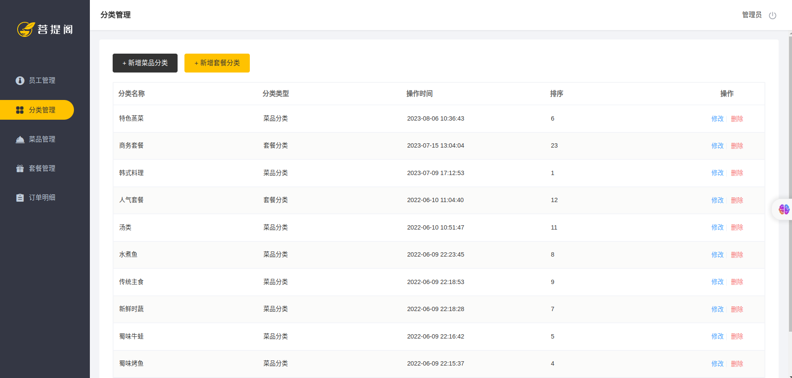
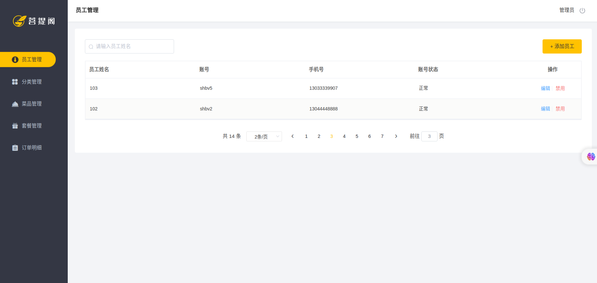
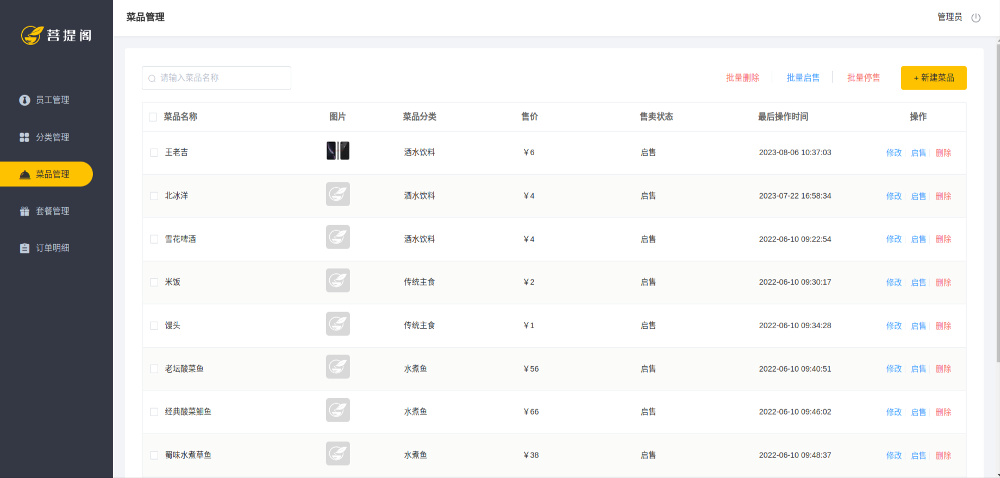

## 瑞吉外卖项目说明
> 对你有用的话，希望能给项目点个Star，非常感谢。

> 对于项目的任何问题，或者你在本地部署时遇到的无法解决的问题，都可以提交issues，又可能你遇到的问题别人已经提交了issues，那么你就直接可以得到解决。没有解决的我会在第一时间进行解决和答复

**本项目是SpringBoot+MybatisPlus+Mysql技术栈的前后端分离外卖管理系统。**


本项目（瑞吉外卖）是专门为餐饮企业（餐厅、饭店）定制的一款软件产品，
包括 系统管理后台 和 移动端应用 两部分。 其中系统管理后台主要提供给餐饮企业内部员工使用，
可以对餐厅的分类、菜品、套餐、订单、员工等进行管理维护。 移动端应用主要提供给消费者使用，
可以在线浏览菜品、添加购物车、下单等。
## 0 项目进度

| 时间  | 完成内容           | 备注      |
|-----|----------------|---------|
|  `2023-07-22`   | 登陆管理、员工管理、菜品管理 |    完成P69     |
|   `2023-08-07`  | 套餐管理           |     完成P75    |

## 1 快速上手
- 导入项目的SQL文件 `src/main/resources/eaterDemo.sql`
- `application-test.yml` 需要配置`spring.datasource.druid`的`username`和`password`
- 启动项目
- 访问后台登录界面 `http://localhost:9999/backend/page/login/login.html`

## 2 技术栈
后端：
- SpringBoot
- MySql
- Mybatis Plus
- Redis
## 3 功能需求

## 4 项目说明
```text
主程序

── reggiedemo
    ├── common  通用类
    ├── config  配置
    ├── controller 控制层
    ├── dto    
    ├── entity 实体
    ├── filter 过滤器，过滤
    ├── mapper
    ├── ReggieDemoApplication.java
    └── service 服务层
```

## 4 项目模块
- 🔺后台
  - [X] 登录模块
  - [X] 员工管理
  - [X] 分类管理
  - [X] 菜品管理
  - [ ] 套餐管理
  - [ ] 订单管理
- 🔻前台
  - [ ] 用户模块
  - [ ] 购物车模块
  - [ ] 地址模块
  - [ ] 订单模块
  - [ ] 菜品模块
## 4 效果展示
<details>
  <summary>登录界面</summary>
  
</details>
<details>
  <summary>分类管理</summary>
  
</details>

<details>
  <summary>员工管理</summary>
  
</details>

<details>
  <summary>菜品管理</summary>
  
</details>

## 5 参考
视频参考：**[瑞吉外卖——实战项目](https://www.bilibili.com/video/BV13a411q753/?share_source=copy_web&vd_source=93aa00906c2c29d639fffa4a9090899a)**

